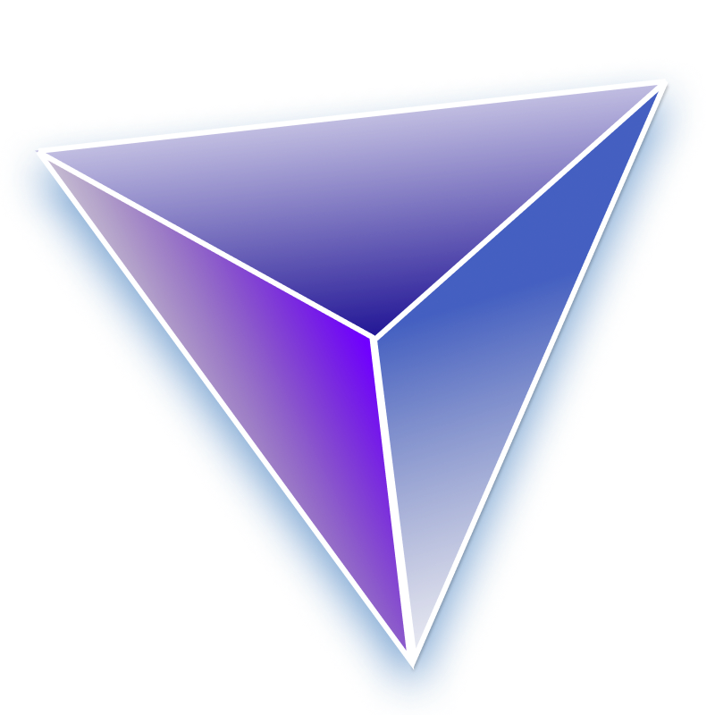
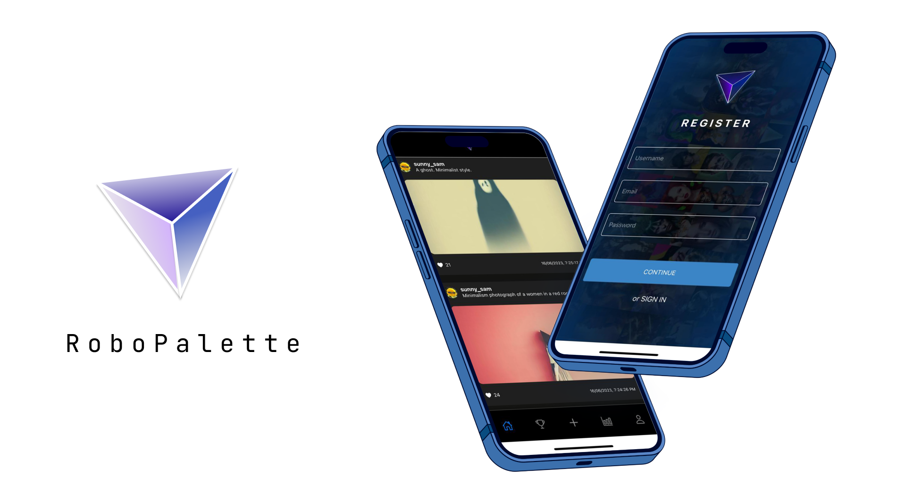
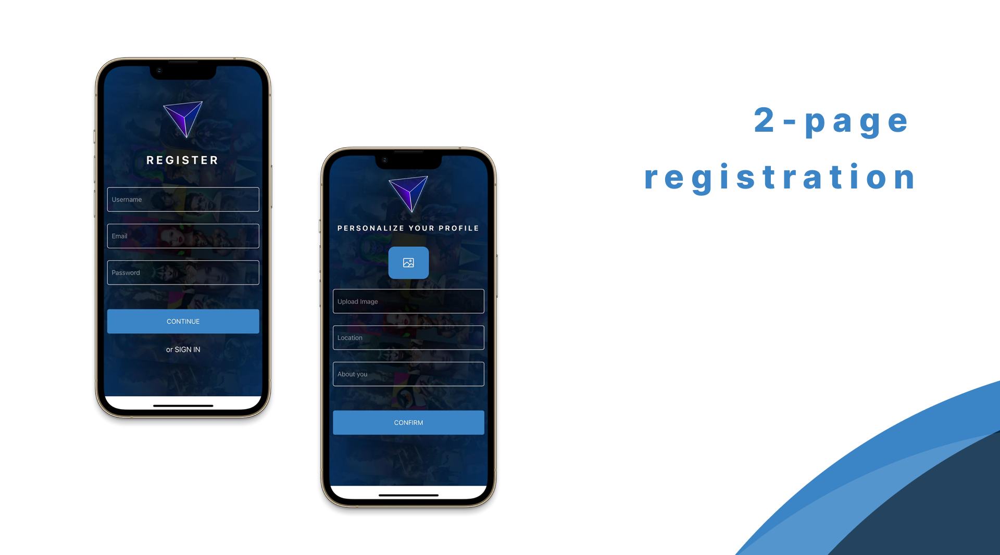
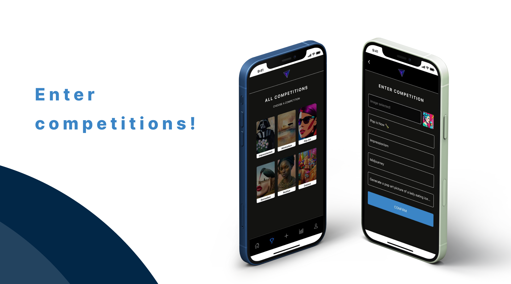
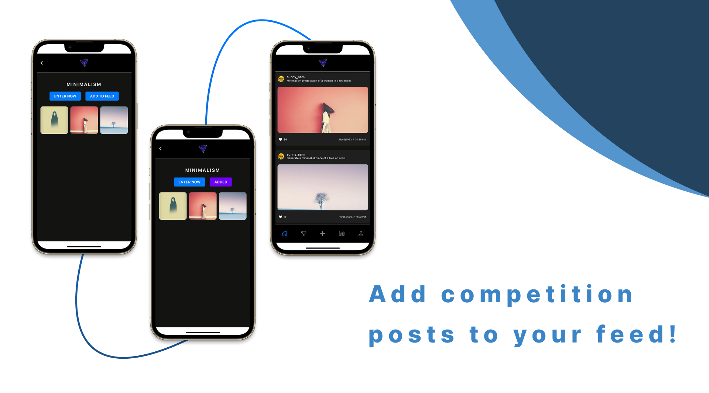
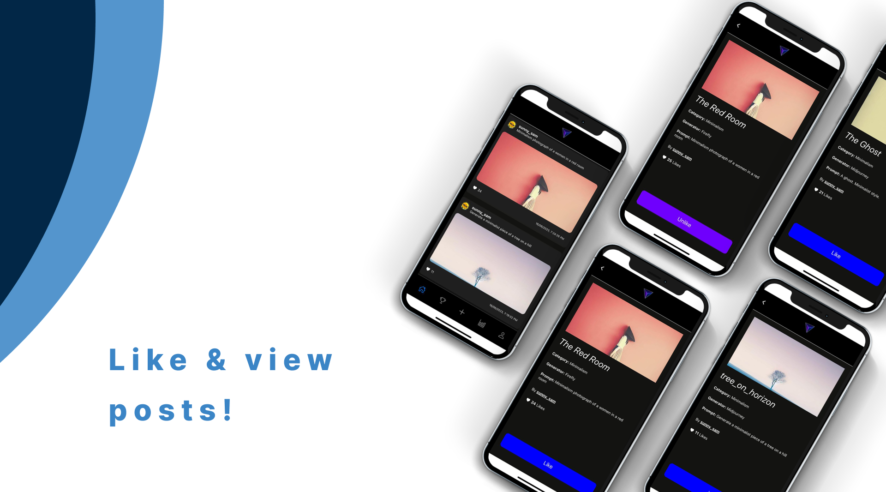
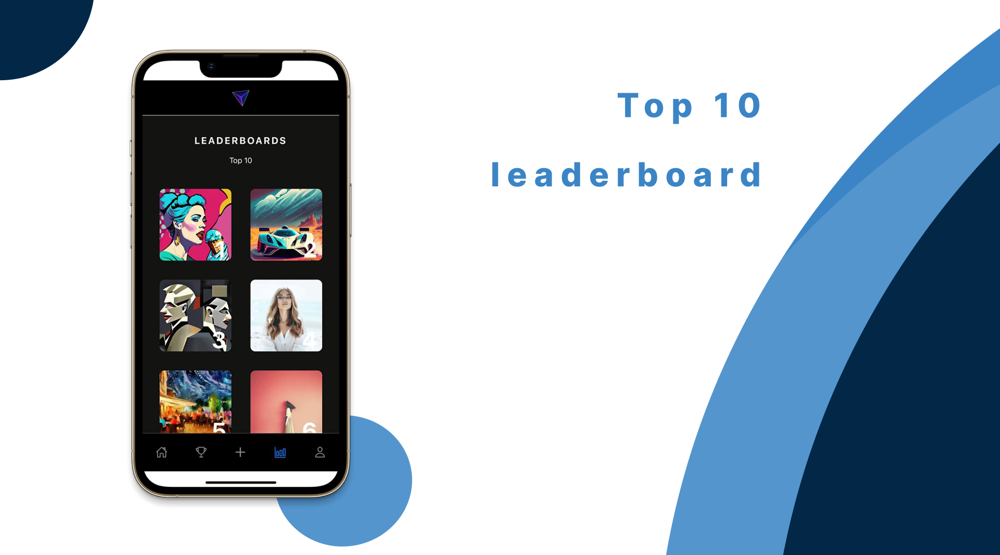
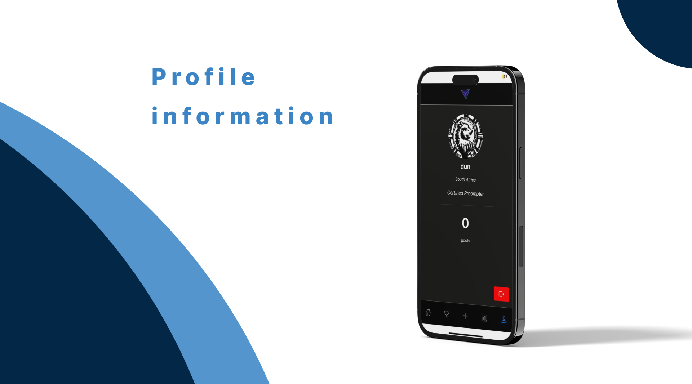

# RoboPalette

<!-- Repository Information & Links-->
<br />


[![Instagram][instagram-shield]](https://www.instagram.com/kay_pharoah/)
<!-- [![LinkedIn][linkedin-shield]][linkedin-url] -->

<!-- [![Behance][behance-shield]][behance-url] -->

<!-- HEADER SECTION -->
<h5 align="" style="padding:0;margin:0;">Kyle Pharoah</h5>
<h5 align="" style="padding:0;margin:0;">200277</h5>
<h6 align="">Interactive Development 300</h6>
</br>
<p align="">

  <a href="https://github.com/xviovx/RoboPalette">
    
  </a>
  
  <h3 align="">RoboPalette</h3>

  <p align="">
    AI-generated image competition <br>
      <!-- <a href="https://github.com/username/projectname"><strong>Explore the docs »</strong></a> -->
   <br />
   <a href="https://youtu.be/Jt3TcsPCClU">View Demo</a>
    ·
    <a href="https://github.com/xviovx/RoboPalette/issues">Report Bug</a>
    ·
    <a href="https://github.com/xviovx/RoboPalette/issues">Request Feature</a>
</p>
<!-- TABLE OF CONTENTS -->

## Table of Contents

* [About](#about)
  * [Description](#description)
  * [Built With](#built-with)
* [Getting Started](#getting-started)
  * [Installation](#installation)
* [Features and Functionality](#features-and-functionality)
  * [Registration](#registration)
  * [Enter competitions!](#enter-competitions)
  * [Add posts to your feed!](#add-posts-to-your-feed)
  * [Like & view posts!](#like--view-posts)
  * [View the leaderboard!](#view-the-leaderboard)
  * [Profile information!](#profile-information)
* [Concept Process](#concept-process)
   * [High Fidelity Wireframes](#high-fidelity-wireframes)
* [Future Features](#future-features)
* [Contributing](#contributing)
* [Authors & Contact](#authors--contact)
* [Acknowledgements](#acknowledgements)


<!--PROJECT DESCRIPTION-->
## About
<!-- header image of project -->


### Description

Welcome to RoboPalette! Dive into competitions, appreciate unique artworks, and get your creations seen. 

Participate, gather likes, and you might find your artwork on the 'Top Ten' leaderboard. 

A perfect place for gaining inspiration to improve your own prompts!

Let's bring AI-art to life together!

<br>


### Built With

* [React Native](https://reactnative.dev/)
* [Expo](https://expo.dev/)
* [Firebase](https://firebase.google.com/)
<!-- GETTING STARTED -->
<!-- Make sure to add appropriate information about what prerequesite technologies the user would need and also the steps to install your project on their own mashines -->
## Getting Started

The following instructions will get you a copy of the project up and running on your local machine for development and testing purposes.

### Installation

Follow these steps to get this project running on your machine:

1. **Clone the Repository** 

    Run the following command in your terminal to clone the project:
    ```sh
    git clone https://github.com/xviovx/RoboPalette.git
    ```

2. **Open the Project** 

    Open VS Code, select `File | Open...` from the menu, navigate to the cloned directory, and press `Open`.

3. **Install Expo CLI** 

    Expo CLI is a command-line tool used for different tasks in the development life cycle of your project. You can use it by running the following command in your terminal:
    ```sh
    npx expo-cli
    ```

4. **Install Dependencies** 

    Run the following command in your terminal to install all the required dependencies:
    ```sh
    npm install
    ```
    Also, install the React Native Firebase "app" module to the root of your React Native project with the following command:
    ```sh
    npm install --save @react-native-firebase/app
    ```

5. **Set Up Firebase** 

    To allow the app to securely connect to your Firebase project, a configuration file must be downloaded and added to your project. Follow the instructions provided in the [Firebase Console](https://console.firebase.google.com/).

6. **Install React Navigation** 

    React Navigation is a library to help you deal with navigation logic in your app. To install React Navigation into your project, run the following command in your terminal:
    ```sh
    npm install @react-navigation/native

6. **Additional dependencies** 

    Install any additional dependencies listed in the package.json file
  
    ```

<!-- FEATURES AND FUNCTIONALITY-->
<!-- You can add the links to all of your imagery at the bottom of the file as references -->
## Features and Functionality


<br>

### Registration

* 2-page registration functionality with authentication. 
* Choose appropriate information for your profile, and preview your profile image.

<br>


<br>

### Enter competitions!

* Enter up to 6 different competitions!
* Share all the information about the image you generated with other users!

<br>



### Add posts to your feed!

* Add individual competition posts to your feed to see the latest posts from your homepage!

<br>



### Like & view posts!

* Like and view other posts by users!
* View the prompt used to generate the artwork, as well as the generator itself. 

<br>



### View the leaderboard!

* See the top 10 hottest posts at the time of viewing, chosen by the community and calculated by the amount of likes!

<br>



### Profile information!

* View the information you added to your profile, as well as the amount of posts you have made.
* Additionally, sign out of your profile and return to the login screen. 


<!-- CONCEPT PROCESS -->
<!-- Briefly explain your concept ideation process -->
## Concept Process


### High Fidelity Wireframes

* Wireframes made in the concept ideation phase 


## Future Features

I hope to implement the following additional features to this project in the future:

* More interactivity between users (viewing of each others profiles, following, perhaps even in-app messaging)
* Edit profile details functionality
* View all of your own posts
* Display the most recent posts from the added categories on the homepage (assuming the app has a sufficient amount of users and entries)
* Another tab on the homepage that shows recent posts or posts from the users you are following
* A wider variety of competitions/ art categories to enter (categories as a whole need refinement)

<!-- CONTRIBUTING -->
## Contributing

Please feel free to make contributions to this project:

1. Fork the Project
2. Create your Feature Branch (`git checkout -b feature/AmazingFeature`)
3. Commit your Changes (`git commit -m 'Add some AmazingFeature'`)
4. Push to the Branch (`git push origin feature/AmazingFeature`)
5. Open a Pull Request

<!-- AUTHORS -->
## Authors & Contact

Kyle Pharoah - [GitHub](https://github.com/xviovx) - [Email](mailto:pharoahkyle@gmail.com) - [Instagram](https://www.instagram.com/kay_pharoah/) 

<!-- ACKNOWLEDGEMENTS -->
## Acknowledgements
<!-- all resources that you used and Acknowledgements here -->
* [React Native Docs](https://reactnative.dev/docs/getting-started)
* [Expo Docs](https://docs.expo.dev/)
* [Firebase Docs](https://firebase.google.com/docs)
* [Armand Pretorius](https://github.com/Armand-OW)


<!-- Refer to https://shields.io/ for more information and options about the shield links at the top of the ReadMe file -->
[linkedin-shield]: https://img.shields.io/badge/-LinkedIn-black.svg?style=flat-square&logo=linkedin&colorB=555
[linkedin-url]: https://www.linkedin.com/in/nameonlinkedin/
[instagram-shield]: https://img.shields.io/badge/-Instagram-black.svg?style=flat-square&logo=instagram&colorB=555
[instagram-url]: https://www.instagram.com/instagram_handle/
[behance-shield]: https://img.shields.io/badge/-Behance-black.svg?style=flat-square&logo=behance&colorB=555
[behance-url]: https://www.behance.net/name-on-behance/